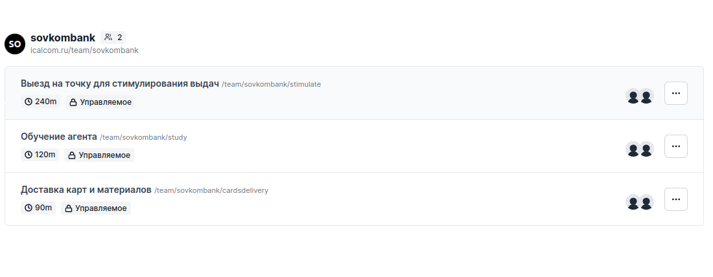
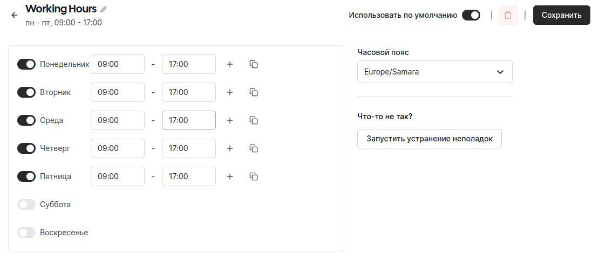
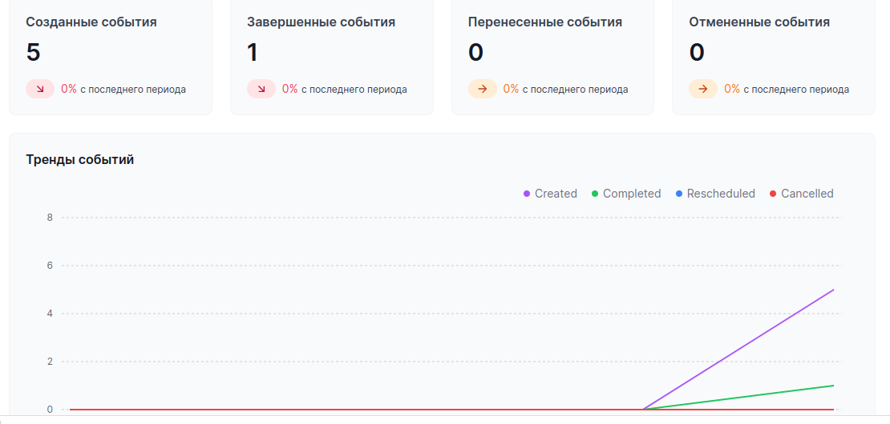

# icalcomlct

## Ссылки

### Интерфейс администратора
http://62.113.107.72:8080/
В прототип можно загрузить файл [datset.xlsx](datset.xlsx)

### GPV v3 календарь https://icalcom.ru/ 
| Логин  | Пароль |
| ------------- | ------------- |
| onboarding@example.com  | onboarding  |
| free@example.com | free  |

Данный сервис используется для заведения сотрудников, распределения по офисам и настройке времени работу сотрудников.
В сервисе строится аналитическая отчетность.

## Схема работы сервиса 

Исходный код: [api.py](api.py)

1. Построение матрицы расстяний с помощью OSMR
2. Решение  задачи коммивояжера с помощью vroom
3. Создание задач сотрудникам в сервисе icalcom.ru (облачном или на серверах заказчика)

## Использованные ресурсы и лицензии

Все ресурсы размещаются в облаке или на серверах заказчика

1.  OSRM является свободным, с открытым исходным кодом и доступен под очень разрешительной (упрощенной) 2-пунктной лицензией BSD.
2.  VROOM является свободным, с открытым исходным кодом и доступен под очень разрешительной (упрощенной) 2-пунктной лицензией BSD
3.  CAL.COM с открытым кодом, лицензция AGPLv3

## Скриншоты

### Настройка событий

### Часы работы сотрудника

### Аналитика

