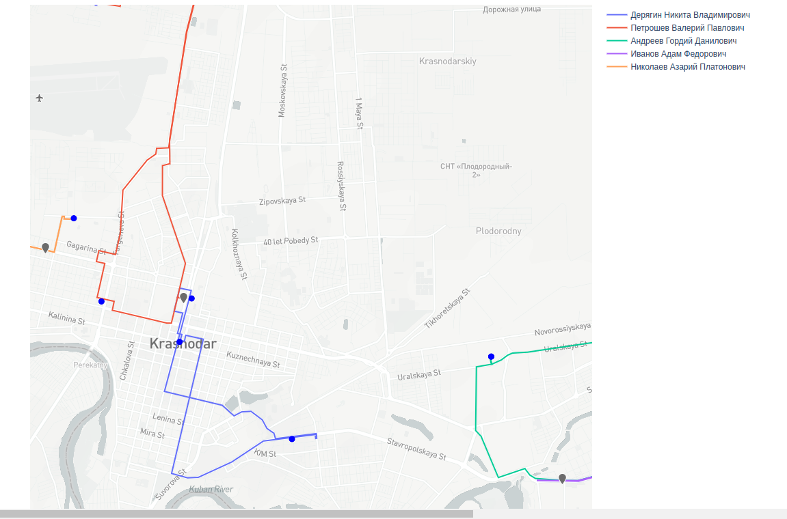
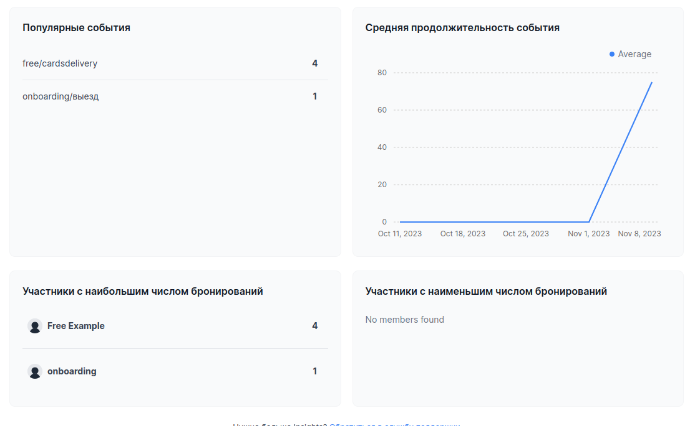

# icalcomlct

## Ссылки

### Интерфейс администратора
http://62.113.107.72:8080/
В прототип можно загрузить файл [datset.xlsx](datset.xlsx)

На данном ресурсе можно посмотреть распределение задач и карту маршрутов с последовательностью посещения точек продаж,
загрузить иной файл с заданиями.

### Планировщик https://icalcom.ru/ на базе открытого решения CAL.COM
| Логин  | Пароль |
| ------------- | ------------- |
| onboarding@example.com  | onboarding  |
| free@example.com | free  |

Данный сервис используется для заведения сотрудников, распределения по офисам и настройке времени работу сотрудников.
В сервисе строится аналитическая отчетность.

Есть синхронизация с google calendar и другими внешними или корпоративными календарями.

## Схема работы сервиса 

Исходный код: [api.py](api.py)

1. Построение матрицы расстояний с помощью проекта OSMR по картам OpenStreetMap
2. Решение  задачи коммивояжера с помощью проекта VROOM.
3. Создание задач сотрудникам в сервисе https://icalcom.ru (на базе CAL.COM)

## Использованные ресурсы и лицензии

Все ресурсы могут размещаются в облаке или на серверах заказчика (on-premise) без доступа к данным у третьей стороны.

1.  Проект OSRM является свободным, с открытым исходным кодом и доступен под очень разрешительной (упрощенной) 2-пунктной лицензией BSD.
2.  Проект VROOM является свободным, с открытым исходным кодом и доступен под очень разрешительной (упрощенной) 2-пунктной лицензией BSD
3.  Проект CAL.COM с открытым кодом, лицензция AGPLv3

## Скриншоты

### Карта маршрутов

### Настройка событий

### Часы работы сотрудника

### Аналитика

